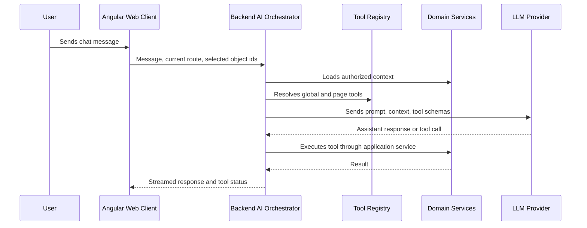

# AI Assistant

EstateOps includes an AI Assistant sidebar hosted inside the web application.

The assistant should behave like a modern chat client while being deeply integrated with the current application context.

## Goals

- Help users find information faster.
- Explain the current page and related data.
- Prepare safe updates.
- Create tasks, notes, and reminders.
- Navigate the user to relevant areas.
- Use page-specific tools when the user is looking at a property, unit, resident, or lease.

## Non-Goals

- The LLM must not receive unrestricted database access.
- The LLM must not execute arbitrary SQL.
- The LLM must not bypass organization membership, roles, or permission checks.
- The frontend must not expose provider API keys.
- UI-supplied context must not be trusted as authoritative business data.

## High-Level Flow

## Provider Settings

Users with sufficient permissions should be able to configure:

- Provider type.
- Base URL.
- API key.
- Default model.
- Optional request defaults.

These settings should be organization-scoped by default.

API keys must be encrypted at rest and never sent back to the frontend after saving.

## Conversations

AI conversations should be stored.

The user can start a new chat, continue the current chat, or reopen older conversations through a dropdown or conversation selector. This should feel similar to common LLM chat products.

Suggested model:

- `AiConversation` stores organization, user, title, status, timestamps, and optional route/object context.
- `AiConversationMessage` stores user messages, assistant messages, tool-call requests, tool-call results, and confirmation events.

Conversation storage is organization-scoped. A user should only see conversations that belong to the current organization and that they are allowed to access.

The initial product does not have an automatic hard retention limit. Conversations are stored until a user archives, deletes, or bulk-cleans them.

Users should be able to:

- Archive a conversation.
- Delete a conversation.
- Bulk-delete conversations older than a chosen age, for example older than 30 days.

Before production, the project still needs clear deletion behavior because AI conversations can contain personal data. The planning baseline is: no automatic expiration by default.

## Context Strategy

The frontend can send lightweight context:

- Current route.
- Current organization id.
- Current selected object id, such as `residentId` or `leaseId`.
- Visible page type.

The backend must rehydrate the actual business context from the database after checking permissions.

Example resident-page context:

- Current resident summary.
- Active and historical leases.
- Related unit and property names.
- Current rent term if there is an active lease.
- Open tasks.
- Recent notes.
- Related documents metadata.

## Tool Types

### Global Tools

Available across the application:

- Search properties, units, residents, and leases.
- Navigate to an application route.
- Create a task.
- Create a note.
- List open tasks.
- Explain current organization settings.

### Page-Specific Tools

Examples for a resident page:

- Get resident details.
- List resident leases.
- Prepare resident contact update.
- Create resident note.
- Create task for resident.
- Show related documents.

Examples for a lease page:

- Get lease details.
- List rent terms.
- Prepare rent term change.
- Show generated receivables when accounting is added.
- Create lease-related task.

## Tool Execution Rules

Every tool call must include:

- Current `UserId`.
- Current `OrganizationId`.
- Tool name and version.
- Input payload.
- Permission check.
- Validation result.
- Audit behavior.

Tools should be implemented as backend application services. The LLM calls tools through schemas, but the actual execution path must be the same safe backend path used by normal UI actions.

## Confirmation Model

Low-risk read actions can execute directly after authorization.

Potentially destructive or business-relevant write actions should require explicit user confirmation.

Examples that require confirmation:

- Changing resident personal data.
- Creating or changing rent terms.
- Marking a lease as terminated.
- Deleting or anonymizing records.
- Sending emails or external notifications.

The assistant can prepare a proposed change. The user confirms it in the UI. The backend then executes it.

## Audit

AI actions should be auditable.

Audit log entries should capture:

- User.
- Organization.
- Tool name.
- Target object.
- Input summary.
- Result.
- Timestamp.
- Whether the action was AI-prepared and user-confirmed.

Sensitive prompt contents should not be stored forever without a retention policy. The project needs a retention decision before production.

## UI Direction

The assistant should be a persistent sidebar on desktop and an accessible panel/sheet on mobile.

Expected UI elements:

- Conversation list or current conversation.
- Conversation selector for older chats.
- New chat action.
- Streaming assistant response.
- Tool-call status.
- Confirmation cards for proposed changes.
- Provider/model indicator in settings, not necessarily in the main chat.
