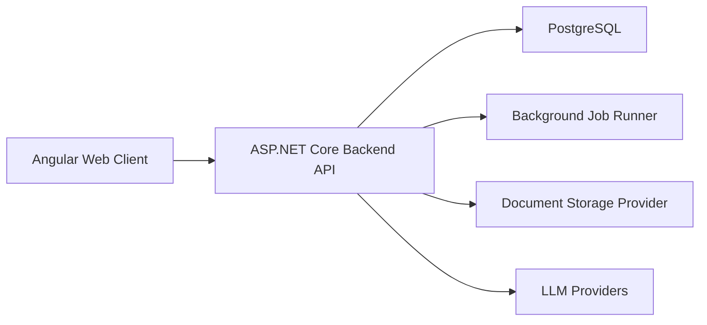

# Architecture

EstateOps should be implemented as a web application with a dedicated backend API.

## Recommended Shape



## Why A Backend API Is Required

The Angular client should not connect directly to PostgreSQL or LLM providers.

A backend API is needed for:

- Authentication and session management.
- Organization membership checks.
- Strict organization data isolation.
- Role and permission enforcement.
- Server-side validation.
- Audit logging.
- Document upload and download control.
- LLM provider API-key protection.
- AI tool execution and guardrails.
- Background jobs.
- Database migrations.
- Future integrations.

## Technology Baseline

Planning baseline as of 2026-06-21:

- Frontend: Angular with TypeScript.
- Frontend styling: Tailwind CSS with daisyUI.
- Frontend behavior: Angular components, with Angular CDK-style patterns for overlays, focus management, menus, dialogs, and accessibility where needed.
- Backend: ASP.NET Core on .NET 10 with C# 14.
- Database access: Entity Framework Core.
- PostgreSQL provider: `Npgsql.EntityFrameworkCore.PostgreSQL`.
- Database: PostgreSQL.
- Package management: npm for the frontend.
- Deployment: Docker images, with Docker Compose for local development.

The backend should use EF Core migrations as the canonical schema migration mechanism.

## Suggested Solution Layout

The exact repository layout can be adjusted during scaffolding, but the initial direction is:

```text
EstateOps/
  docs/
  src/
    EstateOps.Api/
    EstateOps.Application/
    EstateOps.Domain/
    EstateOps.Infrastructure/
    EstateOps.Web/
  tests/
    EstateOps.Api.Tests/
    EstateOps.Application.Tests/
    EstateOps.Infrastructure.Tests/
  docker/
```

## Backend Layers

`EstateOps.Domain`

Contains domain entities, value objects, domain rules, and domain events. It should not depend on EF Core or ASP.NET Core.

`EstateOps.Application`

Contains use cases, commands, queries, interfaces, validation, authorization decisions, and application-level services.

`EstateOps.Infrastructure`

Contains EF Core persistence, PostgreSQL configuration, document storage providers, email providers, LLM provider implementations, and background-job infrastructure.

`EstateOps.Api`

Contains HTTP endpoints, authentication, request/response contracts, dependency injection setup, API documentation, and realtime/streaming endpoints for the AI assistant.

`EstateOps.Web`

Contains the Angular application.

## Frontend Architecture

The Angular application should be organized by product areas:

- Shell and navigation.
- Authentication.
- Organization switcher.
- Properties.
- Units.
- Residents.
- Leases.
- Documents.
- Notes and tasks.
- Settings.
- AI Assistant sidebar.

The frontend should be responsive by design and support German text through an internationalization setup rather than hardcoded UI strings.

CSS and component styling are documented in [Frontend UI](./frontend-ui.md).

The application should avoid mixing multiple full CSS frameworks. Bootstrap is not the primary UI framework.

## Background Jobs

The architecture should reserve a dedicated background-job mechanism.

Planned job examples:

- Generate monthly lease receivables for active leases on the first day of a month.
- Apply or announce planned rent increases.
- Send task reminders.
- Process document metadata.
- Execute anonymization jobs.

The first implementation can use ASP.NET Core hosted services if requirements stay simple. Once jobs need persistence, retries, dashboards, or distributed execution, the project should evaluate Quartz.NET or Hangfire.

Recurring business jobs must be idempotent. For example, monthly receivable generation must not create duplicate receivables if a job is retried.

## Document Storage

Documents should be modeled through a storage abstraction.

Default storage: PostgreSQL.

Planned alternative storage: external providers such as Dropbox, S3-compatible object storage, Azure Blob Storage, or another document store.

The domain should never assume that file bytes are always stored in PostgreSQL. Document metadata and access control stay in EstateOps. The physical content can live in a pluggable storage provider.

## API Design Direction

The API should be explicit and business-oriented rather than exposing database tables directly.

Examples:

- `GET /api/properties`
- `GET /api/properties/{propertyId}`
- `POST /api/properties/{propertyId}/units`
- `GET /api/residents/{residentId}`
- `POST /api/leases`
- `POST /api/leases/{leaseId}/rent-terms`
- `POST /api/ai/chat`
- `POST /api/ai/tool-calls/{toolCallId}/confirm`

All business endpoints must run in the context of the current organization.
